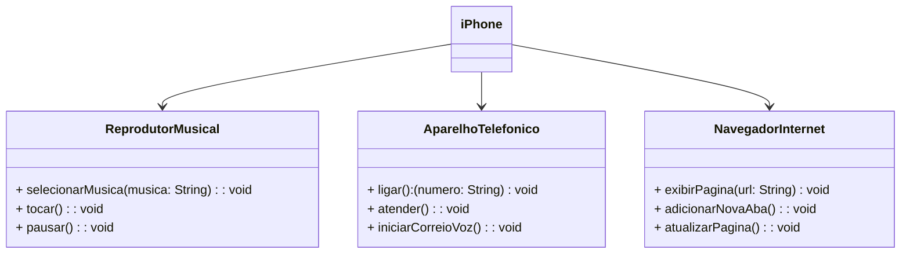

```mermaid
classDiagram
    class ReprodutorMusical {
        + selecionarMusica(musica: String): void
        + tocar(): void
        + pausar(): void 
    }

    class AparelhoTelefonico {
        + ligar(): (numero: String) void
        + atender(): void
        + iniciarCorreioVoz(): void
    }

    class NavegadorInternet {
        + exibirPagina(url: String) void
        + adicionarNovaAba(): void
        + atualizarPagina(): void
    }

    class iPhone {
    }

    iPhone --> ReprodutorMusical
    iPhone --> AparelhoTelefonico
    iPhone --> NavegadorInternet
```
